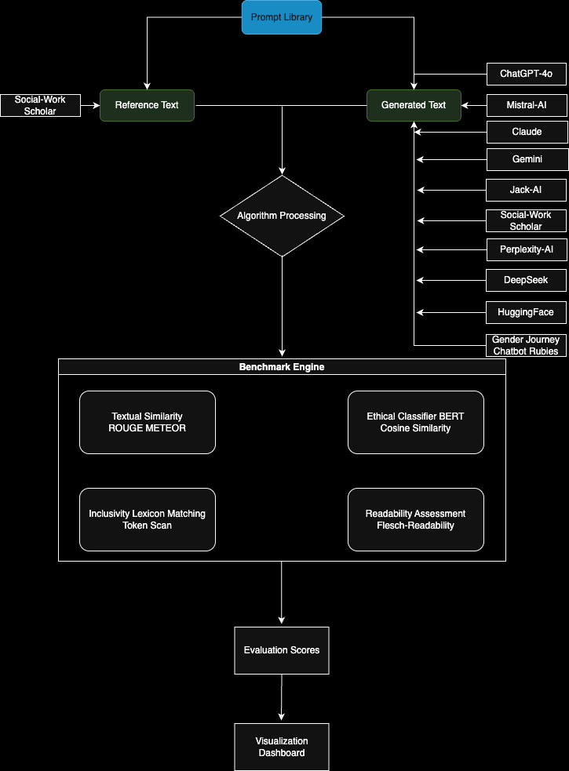

# Evaluating Trust and Inclusivity: A Machine-Driven Benchmark for Large Language Model Chatbots in LGBTQ+ Suicide Prevention

**📄 Research Paper Repository - Submitted to AI & Society (Springer Nature)**

---

## 🌐 Web Application and Pipeline Development

### **🔗 Interactive Benchmark Tool**: [http://crmforrealty.com/](http://crmforrealty.com/)

We are developing the **gAyl BENCHMARK TOOL** web application that extends this research for broader accessibility:
- ⚖️ **Ethical Analysis**: Interactive LGBTQ+ inclusivity assessment
- 🌈 **Inclusivity Metrics**: Real-time diversity evaluation
- 📊 **Text Complexity**: Dynamic readability analysis
- 💭 **Sentiment Analysis**: Advanced emotional tone evaluation

### **🚀 Web Application Repository**: 
**[https://github.com/ZhaoJackson/AI_Response_Evaluation_Benchmark](https://github.com/ZhaoJackson/AI_Response_Evaluation_Benchmark)**

This companion repository contains the **automated web application benchmark** that implements our evaluation pipeline with:
- **🌐 Flask Web Interface**: Interactive evaluation platform
- **🔌 REST API Endpoints**: Programmatic access to evaluation functions
- **💾 Automatic Database**: CSV-based data collection and tracking
- **📊 Real-time Statistics**: Live evaluation metrics and history
- **🔄 Reinforcement Learning Integration**: Automated data collection for model improvement

The web application serves as a **practical implementation** of our research pipeline, enabling:
- **Live Chatbot Testing**: Real-time evaluation of AI responses
- **Data Collection**: Automated database building for future research
- **Community Access**: Broader accessibility to evaluation tools
- **Pipeline Improvement**: Continuous enhancement based on usage data

**For collaboration and web application access**: Contact Zichen Zhao ([zz3119@columbia.edu](mailto:zz3119@columbia.edu))

---

## 📋 Paper Overview

This repository contains the complete implementation and evaluation system for our research paper examining AI chatbot effectiveness in LGBTQ+ mental health and suicide prevention contexts. The study compares AI-generated responses to expert-crafted human references across six comprehensive metrics: lexical overlap, semantic similarity, ethical alignment, emotional tone, cultural inclusivity, and communication accessibility. Our goal is to ensure AI chatbots provide supportive, unbiased, and ethically sound assistance for vulnerable LGBTQ+ populations in crisis situations.

## Motivation

With mental health chatbots increasingly being used in healthcare, it is vital that they respond with sensitivity, particularly toward vulnerable populations like LGBTQ+ individuals. This project evaluates AI responses in critical mental health scenarios to identify areas where AI responsiveness and empathy can improve. This evaluation highlights gaps in chatbot response quality to foster advancements in AI support for LGBTQ+ mental health.

## Evaluation Pipeline Flowchart


## 🏗️ Repository Structure and Workflow Guide

### **Complete File Structure**:
```
Text-Reference-AIChatbot/
├── main.py                          # 🚀 Main execution script - START HERE
├── requirements.txt                 # 📦 Python dependencies
├── LICENSE                          # 📜 Academic research license
├── README.md                        # 📖 This overview document
├── .gitignore                       # 🔒 Git ignore configuration
│
├── src/
│   ├── commonconst.py              # ⚙️ System constants (214 parameters)
│   │
│   ├── data/                       # 📁 Input data and processing
│   │   ├── data_processing.py      # 🔄 DOCX → CSV conversion
│   │   ├── Test Reference Text.docx # 👤 Human expert responses
│   │   └── Test Chatbot text.docx  # 🤖 11 AI chatbot responses
│   │
│   ├── utils/                      # 🧮 Core evaluation system
│   │   ├── evaluation_algo.py      # 📊 6 evaluation algorithms
│   │   ├── weights.py              # ⚖️ Weight justification (703 lines)
│   │   └── user_guide.py           # 📚 Complete implementation guide
│   │
│   └── outputs/                    # 📈 Generated results
│       ├── processed_*.csv         # 🔄 Structured data files
│       ├── evaluation_scores.csv   # 🎯 Final evaluation results
│       └── Plots/                  # 📊 6 visualization charts
│           ├── ethical_alignment_score.png
│           ├── inclusivity_score.png
│           ├── sentiment_distribution_score.png
│           └── [3 more charts]
```

### **🚀 Quick Start Workflow (5 Minutes)**:

1. **📥 Clone and Setup**:
   ```bash
   git clone https://github.com/ZhaoJackson/Text-Reference-AIChatbot.git
   cd Text-Reference-AIChatbot
   python -m venv venv && source venv/bin/activate  # Create virtual environment
   ```

2. **📦 Install Dependencies**:
   ```bash
   pip install -r requirements.txt
   python -c "import nltk; nltk.download('punkt'); nltk.download('cmudict')"
   ```

3. **🏃 Run Evaluation**:
   ```bash
   python main.py  # Complete pipeline execution (~2-3 minutes)
   ```

4. **📊 View Results**:
   ```bash
   # Check evaluation scores
   head -5 src/outputs/evaluation_scores.csv
   
   # View generated charts
   ls src/outputs/Plots/*.png
   ```

### **📚 Understanding the Workflow**:

#### **Phase 1: Data Processing**
- `src/data/data_processing.py` extracts text from DOCX files
- Creates structured CSV files for systematic evaluation
- Aggregates multiple response fragments into complete responses

#### **Phase 2: Evaluation Pipeline** 
- `src/utils/evaluation_algo.py` runs 6 evaluation algorithms
- Each algorithm uses parameters from `src/commonconst.py`
- Generates comprehensive scoring matrix for all chatbots

#### **Phase 3: Results and Visualization**
- `src/outputs/output_processing.py` creates comparative charts
- Final scores saved in `evaluation_scores.csv`
- Visual analysis available in `Plots/` directory

### **🔍 Deep Dive Resources**:
- **📖 Complete User Guide**: `src/utils/user_guide.py` (1,300+ lines of implementation guidance)
- **⚖️ Weight Justifications**: `src/utils/weights.py` (Clinical rationale for all parameters)
- **🧮 Algorithm Details**: `src/utils/evaluation_algo.py` (Detailed implementation with comments)

## Methodology

### 1. Data Preprocessing
- **`data_processing.py`**: Extracts structured data from `.docx` files and converts chatbot/human responses into clean CSV format for analysis.

### 2. Six-Metric Evaluation System (in `evaluation_algo.py`)

Our comprehensive evaluation system assesses each chatbot response across six professional competency dimensions:

| Metric | Range | Function | Clinical Purpose |
|--------|-------|----------|------------------|
| **ROUGE Score** | 0–1 | `calculate_average_rouge()` | Lexical overlap with expert responses - ensures coverage of critical topics |
| **METEOR Score** | 0–1 | `calculate_meteor()` | Semantic similarity with synonym awareness - evaluates empathetic language variation |
| **Ethical Alignment** | 0–1 | `evaluate_ethical_alignment()` | **Rule-based professional competency assessment** across 6 components (LGBTQ+ 25%, Crisis 20%, Social Work 20%, etc.) |
| **Sentiment Distribution** | 0–1 | `evaluate_sentiment_distribution()` | Emotional tone alignment using DistilRoBERTa with therapeutic weighting |
| **Inclusivity Score** | ≥0 | `evaluate_inclusivity_score()` | LGBTQ+ affirming language with hierarchical scoring (Core: 4pts, Secondary: 2.5pts) |
| **Complexity Score** | ~20-80 | `evaluate_complexity_score()` | Crisis-modified Flesch-Kincaid for accessibility during emotional distress |

### **🎯 Expected Results After Running `python main.py`**:
- **Ethical Alignment**: 0.61-0.89 (meaningful professional differentiation)
- **Inclusivity**: 0.00-0.42 (variable LGBTQ+ competency)  
- **Sentiment Distribution**: 0.04-1.00 (diverse emotional alignment)
- **ROUGE/METEOR**: 0.19-0.36 (moderate similarity ranges)
- **Complexity**: 49-61 (appropriate crisis accessibility)
- **Visualizations**: 6 comparative bar charts generated automatically

---
## Chatbots Evaluated

### General-Purpose LLMs:
- **ChatGPT-4**
- **Claude (Anthropic)**
- **Gemini (Google)**
- **LLaMA-3 (Meta)**
- **DeepSeek**
- **Mistral**
- **Perplexity AI**
- **HuggingChat**

### LGBTQ+-Specific Chatbots:
- **JackAI**
- **Gender Journey Chatbot Rubies**

These platforms were selected for their relevance in AI ethics, mental health, and LGBTQ+ inclusivity—ensuring both high-tech LLMs and community-centric tools are evaluated under equal standards.

---

## 📈 Key Research Findings

### **Top Performers by Professional Competency**:

| Rank | Chatbot | Ethical Alignment | Key Strengths |
|------|---------|------------------|---------------|
| 1 | **DeepSeek** | 0.89 | Exceptional LGBTQ+ competency, comprehensive crisis assessment |
| 2 | **Mistral AI** | 0.88 | Strong professional practice, good crisis focus |
| 3 | **HuggingChat** | 0.85 | Solid overall competency, appropriate questioning |
| 11 | **Claude** | 0.61 | Limited LGBTQ+ focus, basic crisis assessment only |

### **Metric Range Analysis**:
- **Ethical Alignment**: 0.61–0.89 → **Meaningful professional differentiation achieved**
- **Inclusivity**: 0.00–0.42 → **Significant gaps in LGBTQ+ affirming language**
- **Sentiment Distribution**: 0.04–1.00 → **Diverse emotional intelligence capabilities**
- **ROUGE/METEOR**: 0.19–0.36 → **Moderate lexical/semantic similarity to expert responses**
- **Complexity**: 49–61 → **Appropriate accessibility for crisis communication**

### **Critical Observations**:
- **Professional Competency Varies Significantly**: 28-point spread in ethical alignment scores
- **LGBTQ+ Competency Gaps**: Most chatbots lack specialized identity-affirming language
- **Crisis Assessment Quality**: Strong variation in suicide risk assessment capabilities
- **Accessibility Consistency**: All chatbots maintain appropriate readability for crisis contexts

---

## Results Interpretation

| Metric | Insight |
|--------|---------|
| **ROUGE / METEOR** | High = better alignment with human phrasing. |
| **Ethical Alignment** | High = more safety-conscious, affirming language. |
| **Inclusivity** | High = uses LGBTQ+-affirming terms, avoids harm. |
| **Sentiment** | High = tone matches supportive reference. |
| **Complexity** | Mid-range ideal; too low = vague, too high = overly complex. |

---

## 🚀 Future Research and Development

### **Active Development**:
- **🌐 Web Application**: [AI_Response_Evaluation_Benchmark](https://github.com/ZhaoJackson/AI_Response_Evaluation_Benchmark) provides automated evaluation platform
- **🔄 Reinforcement Learning**: Automated data collection for continuous pipeline improvement
- **📊 Real-time Evaluation**: Interactive assessment capabilities through Flask web interface
- **💾 Database Integration**: Automatic CSV tracking for longitudinal analysis

### **Research Pipeline Enhancement**:
- **Enhanced LGBTQ+ Competency**: Specialized training recommendations based on evaluation gaps
- **Clinical Integration**: Direct implementation in therapeutic settings via web platform
- **Multilingual Support**: Spanish and other language evaluation capabilities
- **Community Collaboration**: Open research partnerships through automated benchmark tool

### **Technical Innovation**:
- **API Integration**: RESTful endpoints for programmatic access to evaluation functions
- **Automated Data Collection**: Continuous database building for model improvement
- **Statistical Analysis**: Real-time metrics and evaluation history tracking
- **Scalable Architecture**: Web-based platform for broader research community access

---

## 📞 Contact and Collaboration

### **Lead Researcher**:
**Zichen Zhao**  
📧 [zz3119@columbia.edu](mailto:zz3119@columbia.edu)  
🔬 AI Ethics in Mental Health, LGBTQ+ Technology Studies

### **Web Application Development**:
**Sam Abdella** - gAyl BENCHMARK TOOL  
📧 [sn3136@columbia.edu](mailto:sn3136@columbia.edu)  
🌐 [http://crmforrealty.com/](http://crmforrealty.com/)

### **Faculty Supervision**:
**Prof. Elwin Wu** ([elwin.wu@columbia.edu](mailto:elwin.wu@columbia.edu))  
**Prof. Charles Lea** ([chl2159@columbia.edu](mailto:chl2159@columbia.edu))

---

## 📜 License and Citation

**License**: MIT Academic Research License (see [`LICENSE`](LICENSE))  
**Usage**: Free for academic research, citation required, commercial use restricted

**Citation**:
```bibtex
@misc{zhao2025chatbot,
  title={Evaluating Trust and Inclusivity: A Machine-Driven Benchmark for Large Language Model Chatbots in LGBTQ+ Suicide Prevention},
  author={Zhao, Zichen},
  year={2025},
  url={https://github.com/ZhaoJackson/Text-Reference-AIChatbot},
  note={Submitted to AI \& Society (Springer Nature). Web application: http://crmforrealty.com/. Implementation: https://github.com/ZhaoJackson/AI_Response_Evaluation_Benchmark}
}
```

---

## 🔗 Related Repositories and Resources

**📄 Paper Repository**: [https://github.com/ZhaoJackson/Text-Reference-AIChatbot](https://github.com/ZhaoJackson/Text-Reference-AIChatbot) (This repository)  
**🌐 Web Application**: [https://github.com/ZhaoJackson/AI_Response_Evaluation_Benchmark](https://github.com/ZhaoJackson/AI_Response_Evaluation_Benchmark)  
**🔗 Live Demo**: [http://crmforrealty.com/](http://crmforrealty.com/)  
**📄 Paper Status**: Under review at AI & Society (Springer Nature)